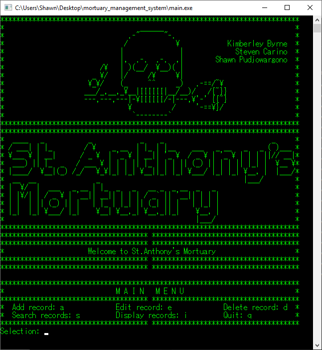

# mortuary_management_system

A command line program demonstrating implementation of various data structures and algorithms, such as trees, hash tables, quick sorting, etc...

### Usage
    
	Execute \mortuary_management_system\dist\Release\Cygwin-Windows\mortuary_management_system.exe to start

### Menu Options:

	|- Add record
	|
	|- Edit record
	|
	|- Delete record
	|
	|- Search records
	|				|- Search by ID
	|				|- Search by Name
	|
	|- Display records
	|				|- Display by ID
	|				|			|- Ascending
	|				|			|- Descending
	|				|
	|				|- Display by Name
	|							|- Ascending
	|							|- Descending
	|- Quit

    
